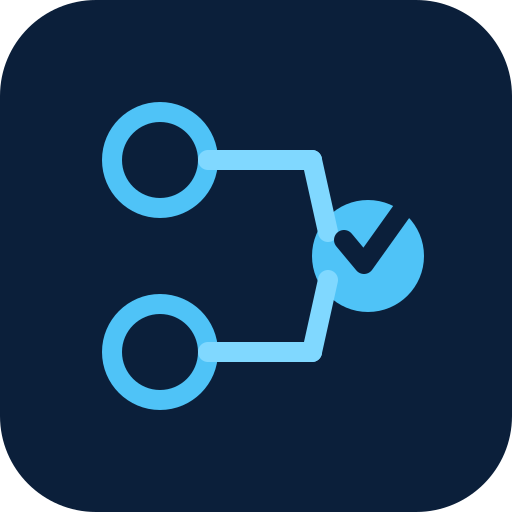

# decision-model-operator

**Safely ship decision models to Kubernetes.**

decision-model-operator evaluates a candidate model on your golden dataset *before* it receives
production traffic, and blocks or rolls back the ones that got worse.

[](https://github.com/maks3201/decision-model-operator/actions/workflows/test.yml)
[](https://github.com/maks3201/decision-model-operator/actions/workflows/test-e2e.yml)
[](https://codecov.io/gh/maks3201/decision-model-operator)
[](https://github.com/maks3201/decision-model-operator/releases)
[](https://artifacthub.io/packages/search?repo=decision-model-operator)
[](https://scorecard.dev/viewer/?uri=github.com/maks3201/decision-model-operator)
[](https://www.bestpractices.dev/projects/15233)
[](LICENSE)

```yaml
apiVersion: decisionmodel.io/v1alpha1
kind: DecisionModel
metadata:
  name: support-router
spec:
  model: laya:en                    # change this line to roll out a new model
  rollout:
    evaluation:
      datasetRef: { configMapRef: { name: support-router-golden, key: cases.jsonl } }
      minAccuracy: "0.90"           # absolute gate
      maxAccuracyDrop: "0.01"       # relative gate: at most 1 point worse than production
```

## The problem

Decision models make production decisions: ticket routing, intent classification, guardrails, risk
scoring, agent and tool selection. A new version can start, load and answer requests, and still make
*worse* decisions. A Kubernetes Deployment only knows that the Pod is alive. It promotes the regression.

When you change `spec.model`, decision-model-operator:

1. resolves the tag to an immutable digest and downloads the weights next to production;
2. starts the candidate without traffic and checks the runtime really loaded **that** digest on
   **that** device (no silent GPU→CPU fallback);
3. runs your evaluation dataset against the candidate and against the current production model;
4. compares the results with your thresholds;
5. switches the Service to the candidate only if every gate passes;
6. otherwise keeps production on the old model, deletes the candidate and records why.

```text
            spec.model changed
                    │
                    ▼
 Resolve digest ─► Download ─► Start candidate ─► Evaluate ──pass──► Switch traffic ─► Ready
                                (no traffic,        (golden set,                        (old model
                                 model-ready gate)   vs production)                      removed)
                                                        │
                                                       fail
                                                        ▼
                                          RolledBack: production untouched,
                                          reason in status and Events
```

## Demo


Real run on kind, sped up about 8×: `laya:en` serves, `laya:multilingual` scores 0.80 on a 40-case English
routing set and is rejected (`minAccuracy 0.90`), `nli:latest` scores 0.925 and is promoted. Reproduce with
`make demo` ([examples/demo](examples/demo/README.md), about 5 minutes on a cold cluster).

## Quickstart

Needs Kubernetes 1.29+ (tested on 1.35, 1.36 and 1.37, see [Compatibility](#compatibility)) with a default
StorageClass (kind works).

<!-- x-release-please-start-version -->
```sh
helm install dmo oci://ghcr.io/maks3201/charts/decision-model-operator \
  --version 0.3.0 --namespace decision-model-operator-system --create-namespace

kubectl apply -f https://raw.githubusercontent.com/maks3201/decision-model-operator/v0.3.0/config/samples/decisionmodel_v1alpha1_decisionmodel_eval.yaml
kubectl get dm support-router -w
```
<!-- x-release-please-end -->

The sample creates the golden dataset ConfigMap and an eval-gated `DecisionModel`. The model is served
at `http://support-router.<namespace>.svc:11435/v1/systemone`. Edit `spec.model` and watch the rollout:

```sh
kubectl describe dm support-router     # conditions, revisions, evaluation, Events
```

A failed gate looks like this in the Events (from the demo):

```text
EvaluationFailed  candidate laya:multilingual@sha256:2840506e failed evaluation: accuracy 0.8000 < minAccuracy 0.9000; laya:en@sha256:c305a927 keeps serving
```

The full walk-through (first request, scaling, proxies, mirrors) is in the
[quickstart guide](https://maks3201.github.io/decision-model-operator/quickstart/).

## Capabilities

| | |
|---|---|
| **Evaluation-gated promotion** | Golden dataset (JSONL) run against candidate and production. Gates: minimum accuracy, maximum accuracy drop vs production, calibration (ECE, maximum ECE increase), sample size, timeout. |
| **Blue-green rollout** | Every model change is a new revision next to the stable one. Traffic moves in one Service switch after the gates pass; the old revision is deleted after a short grace. |
| **Rollback** | A candidate that fails to download, start, load or pass evaluation is rolled back; production keeps serving. The failed revision is recorded and not retried until you change the spec or set a retry token. |
| **Manual promotion** | Hold a candidate that passed evaluation until someone approves it. |
| **Model-aware readiness** | A Pod readiness gate turns True only when the runtime reports the expected digest on the expected device and the model is pinned in memory. |
| **Digest pinning and prefetch** | `laya:en` is resolved to a sha256 digest and recorded in status; weights are prefetched into a per-revision volume and verified before any serving Pod starts. |
| **Status you can read** | Phases, conditions, revisions (stable, candidate, failed, previous), evaluation scores and baselines, Kubernetes Events, Prometheus metrics. |
| **Secure defaults** | Registry allow-list, labelled Secrets only, no image override, restricted Pod security, signed releases with SBOM and provenance. |

## Compatibility

"Tested" means CI runs it on every change or every release; anything else is marked.

| Area | Tested | Notes |
|---|---|---|
| Kubernetes | 1.35, 1.36 and 1.37 nightly (kind, default suite); 1.37 on every change; 1.35 and 1.37 in the upgrade E2E of each release | 1.29+ is required by the APIs the operator uses. Versions below 1.35 are not tested ([RELEASING.md](RELEASING.md#5-support-policy)); exact patch versions are in [`hack/k8s-versions.env`](hack/k8s-versions.env). |
| Runtime: [Ollaya](https://github.com/ollaya-dev/ollaya) | 0.10.0 (default), CPU | 0.7.3 is the oldest accepted `runtimeVersion` (verified in spikes 001 and 006, not in CI). |
| Device `cuda` | Manual only: one T4 GPU on EKS (Bottlerocket), runtime 0.7.3 | No GPU in CI. CUDA on 0.10.0 is not verified yet. |
| Storage | `ReadWriteOnce` (kind `standard`, local-path) | `ReadWriteMany` for `replicas > 1` across nodes is supported by the code but not tested. |
| Models | `laya:en` on every change; more in the nightly matrix | Full list in the [quickstart](https://maks3201.github.io/decision-model-operator/quickstart/#supported-models). |
| Architectures | Operator image amd64 + arm64 | E2E runs on amd64. |
| Ollama `/v1/systemone` | — | Investigated ([spike 004](docs/spikes/004-ollama-engine.md)); not implemented. |

The runtime is behind a small adapter interface (`internal/engine`): resolve a model to a digest, render
the serving and prefetch workloads, inspect what is loaded, warm up. Lifecycle, evaluation and
promotion do not depend on the runtime.

## Why not just use an Ollama operator or a model-serving platform?

Generic operators ([ollama-operator](https://github.com/nekomeowww/ollama-operator),
[KubeAI](https://github.com/kubeai-project/kubeai), [KServe](https://github.com/kserve/kserve)) run
model servers well: workloads, GPUs, autoscaling, model download. They decide a new version is ready
when it is *up*.

decision-model-operator decides a new version is ready when it is *right*:

- it knows the decision-model contract (questions, choices, confidences);
- it evaluates the candidate and compares it with production on the same dataset;
- it blocks the regression before traffic moves and says why;
- it never rewrites the running production revision while a candidate is tried.

It does not try to be a general serving platform, a GPU scheduler, an autoscaler or a model registry.

## How evaluation works

The dataset is JSONL, one case per line:

```json
{"state": {"ticket": "card declined at checkout"},
 "questions": {"q1": {"type": "choice", "options": ["billing", "technical", "account"]}},
 "expected": {"q1": "billing"}}
```

During a rollout the operator sends every case to one candidate Pod (`/v1/systemone`), scores the answers,
and, if a relative gate is set, scores production on the same cases. Results land in `status.evaluation`
(accuracy, baseline accuracy, ECE, Brier, cases) and in the `decisionmodel_evaluation_*` metrics. Details:
[evaluation guide](https://maks3201.github.io/decision-model-operator/evaluation/).

## Production considerations

- **Egress:** the prefetch Job needs `https://ollaya.dev` (manifests) and `https://huggingface.co` plus
  `*.hf.co` (weights), or [internal mirrors](https://maks3201.github.io/decision-model-operator/quickstart/#supported-models)
  for both.
- **Storage:** one PVC per revision; a rollout briefly needs twice the model size. `replicas > 1` across
  nodes needs `ReadWriteMany`.
- **GPU:** `device: cuda` needs amd64 nodes with the NVIDIA device plugin, and a second GPU for the
  candidate during a rollout.
- **GitOps:** a Git commit that changes `spec.model` is the rollout; Argo CD and Flux notes are in
  [docs/gitops.md](docs/gitops.md).
- **Sizing:** per-model memory and disk in [docs/sizing.md](docs/sizing.md).
- **Multi-tenancy:** [namespace-scoped mode](docs/ARCHITECTURE.md#namespace-scoped-mode) and the
  security guards in [docs/ARCHITECTURE.md](docs/ARCHITECTURE.md#9-security).

> **Status: alpha.** The API is `decisionmodel.io/v1alpha1` and may change between minor versions.
> Not affiliated with TypeSafe, Convai Innovations or Ollaya.

## Install options and verification

<!-- x-release-please-start-version -->
```sh
# kubectl instead of Helm
kubectl apply -f https://github.com/maks3201/decision-model-operator/releases/download/v0.3.0/install.yaml
```
<!-- x-release-please-end -->

Images, charts and release files are signed with [cosign](https://github.com/sigstore/cosign) v3+
(keyless, GitHub OIDC); the image carries an SPDX SBOM and SLSA provenance, and release files after v0.2.0
have build provenance attestations:

<!-- x-release-please-start-version -->
```sh
ID='^https://github.com/maks3201/decision-model-operator/.github/workflows/release.yml@refs/'
ISSUER=https://token.actions.githubusercontent.com

cosign verify ghcr.io/maks3201/decision-model-operator:v0.3.0 \
  --certificate-identity-regexp "$ID" --certificate-oidc-issuer "$ISSUER"
cosign verify ghcr.io/maks3201/charts/decision-model-operator:0.3.0 \
  --certificate-identity-regexp "$ID" --certificate-oidc-issuer "$ISSUER"
cosign verify-blob install.yaml --bundle install.yaml.sigstore.json \
  --certificate-identity-regexp "$ID" --certificate-oidc-issuer "$ISSUER"
gh attestation verify install.yaml --repo maks3201/decision-model-operator   # SLSA provenance

docker buildx imagetools inspect ghcr.io/maks3201/decision-model-operator:v0.3.0 --format '{{json .SBOM}}'
```
<!-- x-release-please-end -->

## Documentation

| Guide | |
|---|---|
| [Quickstart](https://maks3201.github.io/decision-model-operator/quickstart/) | Install, first model, request, scaling, proxy and mirror setup, uninstall |
| [Evaluation](https://maks3201.github.io/decision-model-operator/evaluation/) | Datasets, gates, manual promotion, timeouts, retries |
| [API reference](https://maks3201.github.io/decision-model-operator/api-reference/) | Every `DecisionModel` field |
| [Sizing](docs/sizing.md) · [GitOps](docs/gitops.md) · [Metrics](docs/metrics.md) | Operations |
| [Architecture](docs/ARCHITECTURE.md) | Design, state machine, security model |

## Roadmap

| Stage | Scope |
|---|---|
| Released | Evaluation-gated blue-green rollout, rollback, manual promotion, model-aware readiness, digest pinning, prefetch, Ollaya runtime, mirrors, signed releases |
| Next | Score-question evaluation, dataset-bound approvals, runtime version pinned across operator upgrades, rollback after promotion (stabilization window), F1 gates |
| Later | More runtimes (Ollama), shadow traffic, canary percentages |

See [CHANGELOG.md](CHANGELOG.md) for what each release contains.

## Contributing

Issues and pull requests are welcome; see [CONTRIBUTING.md](CONTRIBUTING.md). Questions and ideas go to
[Discussions](https://github.com/maks3201/decision-model-operator/discussions). Report vulnerabilities
privately as described in [SECURITY.md](SECURITY.md).

```sh
make build lint test      # build, golangci-lint, unit + envtest
make test-e2e             # kind cluster with the CPU Ollaya image
```

## License

[Apache License 2.0](LICENSE).
